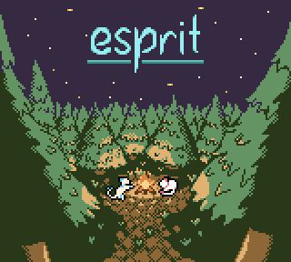
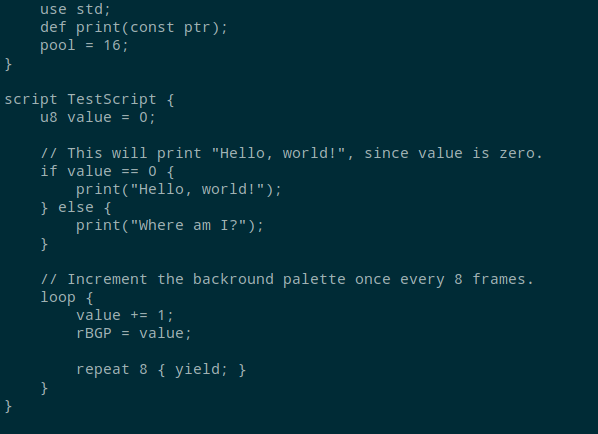
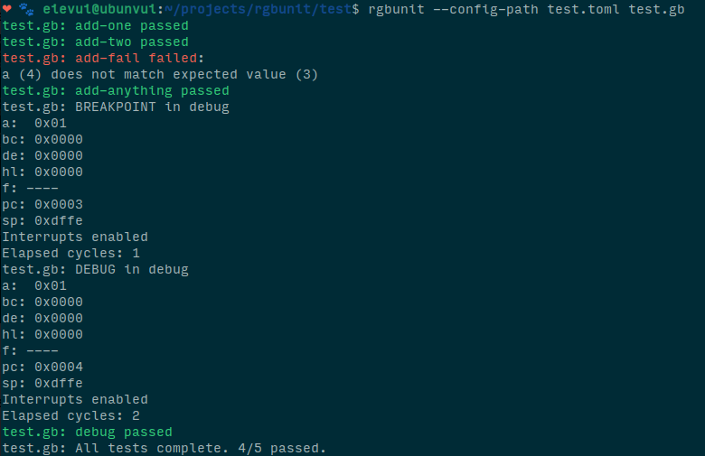
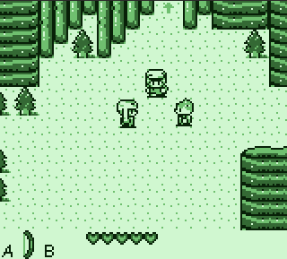

<head>
<title>Evie | Projects</title>

</head>

# Projects

Here are some of the projects I've done!

# [Esprit](https://github.com/eievui5/esprit)

A Game Boy "Mystery Dungeon" engine, making extensive use of the
console's limited video capabilities. Features 8 independant entities which
each have a unique color palette and set of graphics, procedurally
generated levels, a powerful variable-width-font engine which makes text
compact and easy to read, and a custom scripting language created from
scratch for this project, evscript.

# [evscript](https://github.com/eievui5/evscript)

A simple yet versatile programming language originally made for the
Game Boy. Intended to replace the macro based scripting languages often
used in assembly projects, evscript provides control flow structures,
variable declarations and operators, and compact bytecode output which
saves space compared to C or even some assembly code.

<video loop controls style="flex: 50%;">
<source src="evscript-hello-world.mp4" type="video/mp4">
</video>

# [evunit](https://github.com/eievui5/evunit)

A unit testing program for Game Boy ROMs.
Configure tests using TOML files and instantly execute them with the built-in CPU emulator.

# [Kirby’s Dream Land DX](https://github.com/eievui5/kdl-dx)

My first project on the Game Boy, Kirby's Dream Land DX is a romhack
which adds Game Boy Color support to the original game.

<video autoplay loop controls>
<source src="kdl-dx.mp4" type="video/mp4">
</video>

# [VuiBui](https://github.com/eievui5/vuibui-engine)

An extensible Game Boy engine written entirely in RGBASM/SM83 assembly,
with two macro-based scripting languages for programming events and enemies.

Oh, and [this website](https://github.com/eievui5/eievui.ml)!

